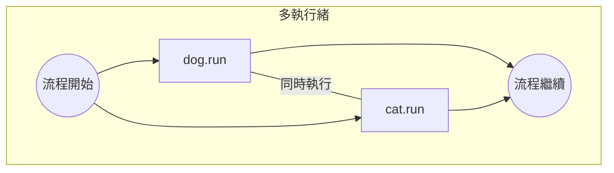
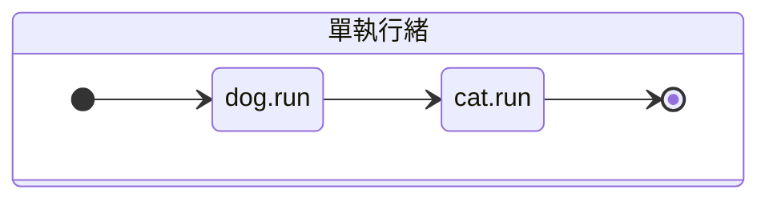
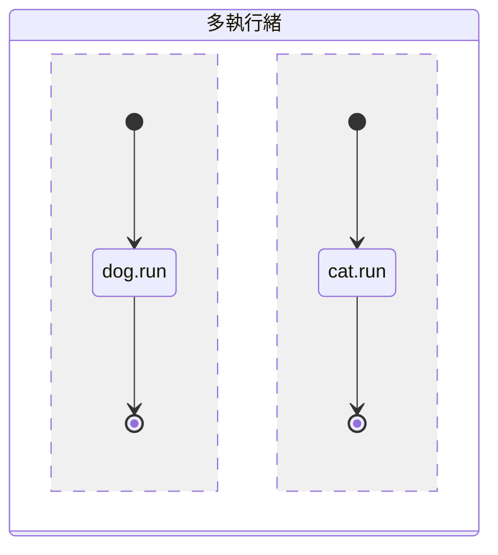

#### 緩衝區 Buffered

##### 認識緩衝區

+ 有緩衝區的檔案處理方式
  + 存取時會先將檔案放到緩衝區
  + 不需要一直做磁碟存取

+ 優點：增加執行效率
+ 缺點：
  + 會增加一塊記憶體空間
  + 可能會因為沒有關閉檔案或系統當機而造成資料流失。

##### 常用BufferReader類別

1. 建構元
    |建構元|主要功能|
    |---|---|
    |BufferedReader(Reader in)|建立緩衝區字元讀取串流|
    |BufferedReader(Reader in, int size)|建立緩衝區字元讀取串流，並設定緩衝區大小|

2. 函數
    |函數|主要功能|
    |---|---|
    |void close()|關閉串流|
    |int read()|讀取單一字元|
    |int read(char[] cbuf, int off, int len)|讀取字元陣列(off表示陣列索引值，len表示讀取位元數)|
    |long skip(long n)|跳過n個字元部讀取|
    |String readLine()|讀取一行字串|

##### 常用BufferWriter類別

1. 建構元
    |建構元|主要功能|
    |---|---|
    |BufferedReader(Reader in)|建立緩衝區字元寫入串流|
    |BufferedReader(Reader in, int size)|建立緩衝區字元寫入串流，並設定緩衝區大小|

2. 函數
    |函數|主要功能|
    |---|---|
    |void close()|關閉串流|
    |void flush()|寫入緩衝區內的字元到檔案裡|
    |void newLine()|寫入換行字元|
    |void write(int c)|寫入單一字元|
    |int write(char[] cbuf, int off, int len)|寫入字元陣列(off表示陣列索引值，len表示讀取位元數)|
    |int write(String s, int off, int len)|寫入字串(off表示陣列索引值，len表示讀取位元數)|

##### 例題

```java hw14_3_2_緩衝區的寫入與讀出
import java.io.*;
class Data{
   String name;
   int english;
   int math;
   Data(){
      
   }
   Data(String str, int e,int m){
      name=str;
      english=e;
      math=m;
   }
   void writeData(BufferedWriter bfw)throws IOException{
      bfw.write(name);
      bfw.newLine();
      bfw.write(Integer.toString(english));
      bfw.newLine();
      bfw.write(Integer.toString(math));
      bfw.newLine();
   }
   void show(){
      System.out.println("name="+name+", english="+english+", math="+math);
      System.out.println("average="+(english+math)/2.0);
   }
}

public class hw14_3_2{
   public static void main(String args[])throws IOException{
      //寫入資料
      FileWriter fw=new FileWriter("c:\\java\\student.txt");
      BufferedWriter bfw=new BufferedWriter(fw);
      Data stu1=new Data("Ariel",92,85);
      Data stu2=new Data("Fiona",67,89);
      stu1.writeData(bfw);
      stu2.writeData(bfw);
      bfw.flush();
      
      //讀取資料
      FileReader fr=new FileReader("c:\\java\\student.txt");
      BufferedReader bfr=new BufferedReader(fr);
      readData(bfr);
   }
   static void readData(BufferedReader bfr)throws IOException{
      Data s=new Data();   
      String str;
      int count=0;      
      while((str=bfr.readLine())!=null){ 
         if(count==0)
            s.name=str;
         if(count==1)
            s.english=Integer.parseInt(str);
         if(count==2){
            s.math=Integer.parseInt(str);
            count=-1;
            s.show();
         } 
         count++;
      }         
   }
}
```


**Output**
name: Ariel
english: 92
math: 85
average: 88.5

name: Fiona
english: 67
math: 89
average: 78.0




+ 可以在相應路徑`c:\\java\\student.txt`內找到檔案
+ 要import `java.io.*`才能使用
+ 使用函式庫要記得拋出例外`throws IOException`


#### 執行緒

##### 認識執行緒 (thread)

執行緒(thread)是指程式的執行流程，「多執行緒」則可同時執行多個程式區塊。
→程式間可以多工同時執行



+ 啟動執行緒
  + 此類別必須延伸自`Thread`類別
  + 執行緒的處理必須撰寫在run()內
+ 啟動語法

    ```java
    class 類別名稱 extends Thread   // 從Thread類別延伸出子類別
    {
        類別裡的資料成員;
        類別裡的函數;
        修飾子 run(){               // 改寫Thread類別裡的run()函數
            以執行緒處理的程序;
        }
    }
    ```

    範例:

    ```java hw15_1
    class CTest extends Thread{
    String id;
    CTest(String str){
        id = str;
    }
    public void run(){
        for(int i=1;i<5;i++){
            for(int j=0;j<1000000000;j++); //空迴圈，拖慢執行速度方便觀察差異
            System.out.println(id+" "+i);
        }
    }
    }


    public class hw15_1{
    public static void main(String args[]){
        CTest hi = new CTest("Hello");
        CTest bye = new CTest("Good Bye");
        
        hi.start();
        bye.start();
    }
    }
    ```


**Output**
Good Bye 1
Hello 1
Good Bye 2
Good Bye 3
Good Bye 4
Hello 2
Hello 3
Hello 4



呼叫`start()`時
會呼叫`run()`內的函數

`hi.start();`
`bye.start();`
同時執行，由於互相搶記憶體空間，因此會有參差時間差






##### 建立執行緒

+ 如果類別本身已經`繼承`某個父類別，可以利用實作`Runnable`的方式建立執行緒
  + `介面`是實現多重繼承的重要方式
  + 把處理執行緒的程式碼，放在實作`Runnable`介面的類別中的`run()`就可以建立執行緒

###### 範例

```java
class hi extends Thread implements Runnable{
   String id;
   hi(String str){
      id = str;
   }
   public void run(){
      for(int i=1;i<5;i++){
         System.out.println(id+" "+i);
         try{
            sleep(1000);
         }catch(InterruptedException e){};
      }
   }
}

class bye extends Thread implements Runnable{
   String id;
   bye(String str){
      id = str;
   }
   public void run(){
      for(int i=1;i<5;i++){
         System.out.println(id+" "+i);
         try{
            sleep(2500);
         }catch(InterruptedException e){};
      }
   }
}


public class hw15_3{
   public static void main(String args[]){
      hi hi = new hi("Hello");
      bye bye = new bye("Good Bye");
      
      
      hi.start();
      bye.start();
   }
}
```


**Output**
    Good Bye 1
    Hello 1
    Hello 2
    Hello 3
    Good Bye 2
    Hello 4
    Good Bye 3
    Good Bye 4



`class hi` 繼承`Thread`實作`Runnable`介面
`public void run()`：改寫`run();`
用`try{} catch(){};`拋出例外：`InterruptedException e`


###### 老師的寫法

```java
class CTest implements Runnable{
   String id;
   int sec;
   CTest(String str,int s){
      id = str;
      sec = s;
   }
   public void run(){
      for(int i=1;i<5;i++){
         try{
            Thread.sleep(sec);
         }catch(InterruptedException e){}
            
         System.out.println(id+" "+i);
      }
   }
}

public class hw15_1{
   public static void main(String args[]){
      CTest hi = new CTest("Hello",1000);
      CTest bye = new CTest("Good Bye",2500);
      
      Thread T1 = new Thread(hi);
      Thread T2 = new Thread(bye);
      
      T1.start();
      T2.start();
   }
}
```

##### 使用Thread 還是Runnable ?

+ 如果只能繼承一個類別，可以實作多個介面
+ 如果要使用多執行緒的類別以經濟成其他類別，就必須`實作``(implement)``Runnable`介面
+ 當某個類別實作`Runnable`介面時，在該類別裡必須要實作`run()`
+ 若是繼承`Thread`類別，要於該類別中改寫`run()`

##### 執行緒的生命週期

+ 每一個執行緒，在其產生和銷毀之前，均會處於下列五種狀態之一：
  + 新產生的 (newly created)
  + 可執行的 (runable)
  + 正在執行的 (executing)
  + 被凍結的 (blocked)
  + 銷毀的 (dead)

+ 執行緒狀態的轉移與函數之間的關係：

    ```mermaid
    stateDiagram

    [*]-->新產生的執行緒
    新產生的執行緒-->可執行的執行緒: strat()
    可執行的執行緒-->執行中的執行緒: wait(), sleep()
    執行中的執行緒-->被凍結的執行緒: wait(), sleep()
    被凍結的執行緒-->[*]

    被凍結的執行緒-->可執行的執行緒: sleep()結束, notify()
    執行中的執行緒-->銷毀的執行緒: run()結束

    ```

+ 被**凍結**的狀態
  + 發生下列事件時，凍結狀態的執行緒便會產生
    + 該執行緒呼叫物件的`wait()`
    + 執行緒本身呼叫`sleep()`
    + 執行緒和另一個執行緒`join()`在一起時
  + 解除被凍結、凍結因素消失的原因
    + 由`wait()`凍結時，`notify()`被呼叫時解除
    + 進入睡眠狀態`sleep()`，指定的睡眠時間結束
  + 銷毀的狀態
    + `run()`執行結束、呼叫`stop()`時，進入銷毀狀態

##### 執行緒的優先順序

+ 執行緒優先順序以數字1~10來表示，數字越大表示修先權越高
+ 相關函數

    |函數|主要功能|
    |---|---|
    |void setPriority(int newPriority)|設定執行緒的優先順序，newPriority()的範圍為1~10|
    |int getPriority()|取得執行緒的優先順序之值|

+ setPriority()中的引數newPriority可使用代碼

    |代碼|意義|
    |---|---|
    |MAX_PRIORITY|最大優先順序之數值|
    |MIN_PRIORITY|最小優先順序之數值|
    |NORM_PRIORITY|系統預設的優先順序之數值|


##### 多執行緒同時處理可能造成的錯誤

```java
class CBank{
    private static int sum = 0;
    public static void add(int n){
        int tmp = sum;
        tmp = tmp+n;    // 累加匯款總額
        try{
            Thread.sleep((int)(1000*Math.random()));    // 小睡0~1秒
        }catch(InterruptedException e){}
        sum=tmp;
        System.out.println("sum= "+sum);
    }
}
class CCustomer extends Thread{     // CCustomer類別, 繼承自Thread
    public void run(){      // run() 函數
        for(int i=1;i<3;i++)
            CBank.add(100);     // 將100元分三次匯入
    }
}

public class app15_8{
    public static void main(String args[]){
        CCustomer c1=new CCustomer(); 
        CCustomer c2=new CCustomer();
        c1.start();
        c2.start();
    }
}
```


**Output**
sum= 100
sum= 100
sum= 200
sum= 300
sum= 200
sum= 300



按照程式題意，`c1`和`C2`是各分三次存300元進CBank
照理說最後 `sum= 600`才對
但是由於多執行緒`同時處理`，讓後處理的執行緒**複寫**了先處理執行緒的`sum`
所以出來的結果會是`sum= 300`


###### 解決方式

+ 只要在`add()`前加上`synchronized`關鍵字

    ```java
    public synchronized static void add(int n){
        ......
    }
    ```

+ `synchronized`本意為**「同步」**，表一次只准許一個執行緒進入`add()`
+ 修改後執行結果如下：

    
    **Output**
    sum= 100
    sum= 200
    sum= 300
    sum= 400
    sum= 500
    sum= 600
    

+ 多個執行緒共用**變數**時，要注意存取順序是否打架